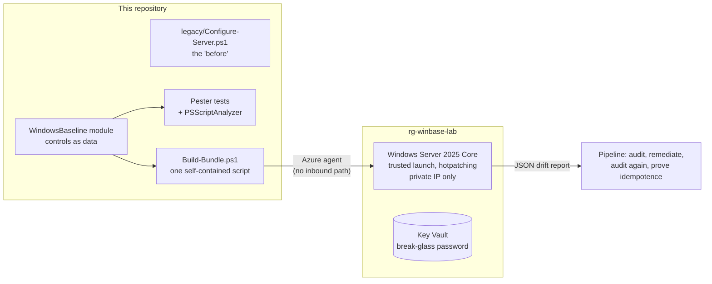

# Windows baseline automation

A legacy PowerShell hardening script, refactored into a tested module and applied to a Windows Server 2025 machine built by Terraform — **with no RDP, no public address, and no credentials on the wire.**

The point of the lab is the distance between the two. `legacy/Configure-Server.ps1` is the kind of script that accumulates in a real estate: comments dated 2019, a warning not to run it on a particular server, no error handling, and a "just rerun it" TODO. The module that replaces it declares the same controls as data, audits without changing anything, remediates only what has drifted, supports `-WhatIf`, and is covered by tests that run anywhere.



## What this demonstrates

| Area | How it's done here |
|---|---|
| **Refactoring legacy automation** | The same six controls, moved from imperative commands to declarative data. Auditing and remediation read the same definitions, so they cannot disagree. |
| **Tested PowerShell** | 17 Pester tests covering drift detection, idempotence, `-WhatIf`, missing values, and the JSON report. Every registry access goes through one mockable seam, so the suite runs on any machine. |
| **Engineering standards** | PSScriptAnalyzer runs over the legacy script and the refactor with the same ruleset, so the comparison means something: 8 findings against 0. A clean run gates the build rather than decorating it. |
| **Windows Server, modernized** | Server 2025 Core, Azure Edition: trusted launch with secure boot and vTPM, hotpatching for most updates without a reboot, and no GUI. |
| **Configuration without access** | The pipeline reaches the machine through the Azure agent. No RDP, no public IP, no bastion, no SSH keys. The local administrator password exists because Azure requires one, and lives in Key Vault for break-glass. |
| **Evidence, not assertion** | The deploy audits a fresh server, shows what would change, remediates, audits again, and then remediates a second time to prove the module is idempotent on a real machine. Reports are kept as build artifacts. |

## The controls

Derived from the CIS Microsoft Windows Server 2025 Benchmark. Each declares a registry location, an expected value, a severity, and why it matters.

| Control | Severity | Why |
|---|---|---|
| SMBv1 server disabled | High | Unauthenticated and unencrypted; the transport WannaCry and NotPetya used |
| RDP requires NLA | High | Without it, a session is established before the user authenticates |
| PowerShell script block logging | Medium | Records what PowerShell actually executed, including code assembled at runtime |
| LLMNR disabled | Medium | Broadcast name lookups are what responder-style credential capture relies on |
| NTLMv2 only | High | Refuses LM and NTLMv1 responses, which are trivially crackable once captured |
| Installer always-elevated disabled | High | Otherwise any user can install a package as SYSTEM |

Registry-backed controls were chosen because they are deterministic and verifiable end to end. Extending the same pattern to `secedit`, services, or Group Policy means adding definitions, not new code paths.

## Before and after

```powershell
# The legacy script: one path, no checks, no way to preview
Set-ItemProperty -Path "HKLM:\...\LanmanServer\Parameters" -Name "SMB1" -Value 0
Write-Host "Done!" -ForegroundColor Green
```

```powershell
# The module: audit, preview, remediate, and prove
Test-WindowsBaseline | Where-Object { -not $_.Compliant }   # what has drifted, and to what
Set-WindowsBaseline -WhatIf                                  # what would change
Set-WindowsBaseline                                          # change only what needs it
Test-WindowsBaseline | New-BaselineReport | ConvertTo-Json   # evidence for the pipeline
```

## Repository layout

```
legacy/               The original script, kept as the "before"
module/WindowsBaseline/   The refactor: controls as data, with comment-based help
tests/                Pester tests; every registry access is mocked
scripts/
  Invoke-Baseline.ps1     The entry point that runs on the server
  Build-Bundle.ps1        Concatenates module + entry point into one script
bootstrap/            One-time setup: state, GitHub OIDC identity, permissions
infra/                Network with no inbound path, the server, and Key Vault
.github/workflows/    CI, Deploy (manual), Destroy (manual + nightly)
```

## Cost

| Resource | Rate | Lab cost |
|---|---|---|
| Standard_B2ls_v2, Windows | $0.0508 per hour | About 2 cents for a deploy-and-verify cycle |
| 32 GB StandardSSD OS disk | Per GB-month | Pennies while it exists |
| Key Vault, network | Within the free grant | ~$0 |

Deploys are manual and the nightly teardown removes everything at 07:00 UTC, so the machine never runs for more than a day.

## How to run it

**Prerequisites:** Terraform 1.9+, Azure CLI, an Azure subscription where you're Owner, and a fork of this repository.

1. **Bootstrap** (once), after creating the repository so its IDs exist:
   ```bash
   az login
   cd bootstrap
   terraform init
   terraform apply \
     -var='github_repository=<owner>/<repo>' \
     -var="github_repository_owner_id=$(gh api repos/<owner>/<repo> --jq .owner.id)" \
     -var="github_repository_id=$(gh api repos/<owner>/<repo> --jq .id)"
   ```
2. **Configure GitHub.** Create an environment named `lab` and add the repository variables from the bootstrap outputs: `AZURE_CLIENT_ID`, `AZURE_TENANT_ID`, `AZURE_SUBSCRIPTION_ID`, `TFSTATE_RESOURCE_GROUP`, `TFSTATE_STORAGE_ACCOUNT`, `TFSTATE_CONTAINER`, `LAB_RESOURCE_GROUP`. None are secrets.
3. **Deploy.** Run the **Deploy** workflow. It builds the server, then audits, previews, remediates, audits again, and remediates once more to prove idempotence. The five JSON reports are kept as artifacts.
4. **Locally**, without any Azure at all:
   ```powershell
   Import-Module ./module/WindowsBaseline/WindowsBaseline.psm1
   Test-WindowsBaseline | Format-Table Id, Severity, Expected, Actual, Compliant
   Invoke-Pester ./tests
   ```
5. **Tear down.** Run **Destroy**, or let the nightly schedule do it.

## Design decisions

- **Controls as data, not commands.** The legacy script encoded each setting once, as an action. Here each is a definition that audit and remediation both read, which is what keeps a drift report and a remediation from disagreeing.
- **A bundle instead of a module feed.** Azure Run Command takes one script, so the build concatenates the module, the entry point, and the call. The server needs no package source, no network access, and no credentials, and runs exactly the code in the commit. The builder parses the result and refuses to ship a bundle that would fail on the machine.
- **The mode is baked into the bundle.** Passing parameters through Run Command varies by platform; generating one script per mode removes the question.
- **No inbound path.** Configuration arrives through the Azure agent. The NSG denies inbound explicitly even though Azure already does, so the intent survives a later edit.
- **`-WhatIf` is not decoration.** It is tested, and the pipeline asserts that a `-WhatIf` run changes nothing before it allows a real one.

## Part of a series

More at [ziyaduqdah.com](https://ziyaduqdah.com/#labs).
